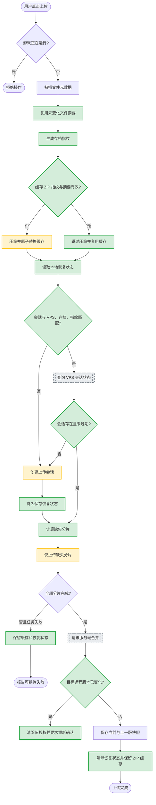

# 压缩缓存与跨重启断点续传

> 所属模块：[save-transfer](../../spec.md)
> 变更编号：001-resumable-upload-cache
> 变更类型：enhance
> 创建日期：2026-08-12

## 1. 变更意图（Why）

大体积 Project Zomboid 存档每次上传都重新压缩，失败后还会删除临时 ZIP 并从第一个分片重新开始，导致重复占用 CPU、磁盘 I/O、网络流量和玩家等待时间。本变更为每个存档保留一份经过校验的最新 ZIP 缓存，并让客户端和 VPS 共同持久化上传会话状态，使相同存档在网络失败、程序关闭或设备重启后能够跳过已完成工作，同时防止旧会话覆盖其他设备刚上传的新版本。

## 2. 范围（What）

### 2.1 In Scope

- 为每个本地存档维护一份最新 ZIP 缓存、文件清单、存档指纹与 ZIP SHA-256。
- 使用相对路径、文件大小、修改时间和单文件 SHA-256 生成确定性的存档指纹。
- 扫描时复用元数据未变化文件的已有 SHA-256，只重新读取并哈希新增或元数据变化的文件。
- 存档指纹未变化且 ZIP 校验通过时跳过压缩，直接进入上传或续传阶段。
- 存档变化时生成新 ZIP，原子替换该存档旧缓存，并使旧上传恢复状态失效。
- 客户端持久保存上传会话标识、存档身份、存档指纹、ZIP SHA-256、分片参数和目标 VPS 身份。
- VPS 提供上传会话状态查询，返回会话元数据、已完成分片索引、创建时间、最后活动时间和过期时间。
- 再次上传时，客户端在缓存与会话均匹配的情况下仅发送缺失分片。
- VPS 未完成上传会话默认保留 7 天，并在相关上传 API 请求或服务启动时执行过期清理。
- 创建会话时记录目标远程快照版本；最终合并前检查该版本是否仍未变化，变化时返回冲突并要求用户重新确认。
- 上传进度从已完成分片对应的字节数开始，明确显示“复用缓存”和“继续上传”状态。

### 2.2 Out of Scope

- 文件级增量上传、ZIP 内部增量合并或二进制差分传输。
- 多个本地 ZIP 历史版本；每个存档只保留最新一份缓存。
- 自动后台上传、周期同步或游戏运行期间上传。
- 多设备同时向同一存档会话写入；恢复会话只属于创建它的同步密钥和客户端缓存状态。
- 暂停按钮、手动选择恢复点或用户可见的上传任务管理中心。
- 本次不实现缓存容量展示和手动清理 UI；缓存可以在应用数据目录中由后续 change 增加管理入口。
- 下载断点续传。

### 2.3 涉及文件（预估）

- `desktop/src-tauri/src/lib.rs`
- `desktop/src/main.js`
- `desktop/src-tauri/Cargo.toml`（仅在需要可靠应用数据目录或原子元数据序列化依赖时）
- `server/src/server.mjs`
- `server/test/api.test.mjs`
- `README.md`
- `server/.env.example`
- `server/deploy/zomboid-sync.service`

### 2.4 流程图（变更后完整流程 + Delta 高亮）

> 移除：上传失败后立即删除 ZIP —— 缓存 ZIP 和恢复状态必须保留，才能在下一次任务继续上传。

## 3. Spec Delta

### 3.A.1 ADDED（新增能力）

- **持久压缩缓存**：每个本地存档在应用数据目录中最多保留一份最新 ZIP，以及可验证该 ZIP 对应存档内容的文件清单、存档指纹和 ZIP SHA-256。位置：spec §3.2、§3.3。
- **增量指纹扫描**：文件清单记录规范化相对路径、大小、修改时间和 SHA-256；路径、大小与修改时间均未变化时复用已有文件摘要，否则重新读取文件计算摘要。所有文件摘要按规范化相对路径确定顺序汇总为存档 SHA-256 指纹。位置：spec §3.3。
- **缓存复用校验**：仅当存档指纹匹配、缓存 ZIP 存在、大小匹配且 ZIP SHA-256 校验通过时跳过压缩；任一条件失败都重新压缩并原子替换缓存。位置：spec §3.3、§3.4。
- **持久恢复状态**：客户端保存 VPS 地址规范化标识、同步密钥不可逆摘要、模式、存档名、存档指纹、ZIP SHA-256、ZIP 大小、分片大小、分片数量和上传会话标识；不得在恢复文件中保存明文同步密钥。位置：spec §3.3、§4.2。
- **会话状态查询**：VPS 允许同一同步密钥查询指定上传会话，返回会话身份、分片参数、已完成分片、创建时间、最后活动时间与过期时间；不得返回其他同步密钥空间的会话。位置：spec §3.3、§4.2。
- **跨任务断点续传**：缓存与恢复状态匹配且 VPS 会话有效时，客户端跳过已完成分片，只上传缺失分片；会话不存在、过期或不匹配时自动创建新会话。位置：spec §3.3。
- **过期会话清理**：未完成会话默认在最后活动后 7 天过期；服务启动和上传相关 API 请求触发清理，删除会话元数据、分片和临时合并文件。保留期可通过服务端环境变量配置。位置：spec §3.4、§5.3。
- **远程版本并发保护**：上传会话记录创建时目标当前快照的版本标识；完成合并前版本不一致时返回冲突，不发布快照，客户端清除旧覆盖授权并要求用户重新获取远程状态和确认。位置：spec §3.3、§3.4、§4.2。

### 3.A.2 MODIFIED（修改能力）

- **上传压缩生命周期**：
  - 旧：每次上传都在系统临时目录重新生成 ZIP，并在上传结束或已处理失败路径中删除。
  - 新：每次上传先扫描并生成存档指纹；有效缓存直接复用，无效缓存才重新压缩。ZIP 保存到应用数据缓存目录，上传成功或可恢复失败后均保留，每个存档仅保留最新一份。
  - 位置：spec §3.3、§3.4。
- **分片失败处理**：
  - 旧：单个分片在当前任务内最多额外重试三次，最终失败后下次从第一片重新开始。
  - 新：保留当前任务内重试；最终失败后保留缓存和恢复状态。下次上传相同存档时查询 VPS 已完成分片并从缺失分片继续。
  - 位置：spec §3.3、§3.4、§6。
- **上传进度语义**：
  - 旧：压缩与上传均从 0% 开始。
  - 新：复用缓存时压缩阶段直接显示已跳过并完成；恢复上传时上传阶段从 VPS 已确认分片对应的真实字节百分比开始，并显示已完成与总分片数。
  - 位置：spec §3.2、§4.1。
- **VPS 临时空间生命周期**：
  - 旧：未完成上传目录持续保留，无状态查询和自动清理。
  - 新：未完成上传具备活动时间、7 天默认过期和惰性/启动清理；有效期内可查询并续传。
  - 位置：spec §3.4、§5.3。

### 3.A.3 REMOVED（移除能力）

无。旧客户端和已完成快照接口保持兼容；新增客户端连接旧服务端时应识别状态查询不可用并退化为创建新会话和完整上传，但仍可复用本地 ZIP 缓存。

## 4. 实施方案（How）

### 4.1 技术方案概述

客户端在 Tauri 应用数据目录下建立按存档身份隔离的缓存目录。缓存元数据使用带版本号的结构化 JSON，并通过临时文件写入后重命名保证原子性。文件清单以规范化相对路径排序；扫描阶段先比较路径、大小和修改时间，仅对变化文件读取内容计算 SHA-256，再对完整清单的稳定序列计算存档指纹。ZIP 生成后计算 SHA-256 并与大小一并保存。上传开始前必须同时验证清单指纹、ZIP 文件大小和 ZIP SHA-256，避免复用损坏缓存。

恢复状态与缓存元数据分开存放。恢复状态绑定规范化 VPS endpoint、同步密钥 SHA-256、存档身份和 ZIP SHA-256，防止把一个服务或密钥的会话错误用于另一个空间。客户端优先查询保存的会话，校验服务端元数据后以已完成分片集合计算真实起始进度；不存在或冲突时创建新会话并原子更新恢复状态。上传完成后只删除恢复状态，保留 ZIP 缓存。

服务端为上传会话增加稳定的 ZIP SHA-256、目标远程快照版本标识、最后活动时间和过期时间。状态查询只能在同步密钥对应的数据空间查找。完成接口在拼接前再次确认会话有效、分片齐全和目标远程版本未变化；冲突时保留分片到过期时间，允许客户端在重新确认后创建新会话，但旧会话不能直接发布。清理函数在服务启动及上传 API 入口节流执行，删除过期会话及残留临时文件，避免每次请求全量扫描造成性能退化。

### 4.2 外部/内部依赖

- 外部：Rust 标准文件系统与 SHA-256 实现、Tauri 应用数据目录能力、Node.js 文件系统与 crypto；不引入数据库。
- 内部：现有存档身份校验、ZIP 压缩、分片 PUT、上传完成、远程清单和进度事件。
- 兼容：服务端新增状态查询接口和会话元数据字段；现有快照列表、下载和直接上传接口保持可用。

### 4.3 TODO 拆解

#### 核心逻辑 / Runtime

- [x] **TODO-S1: 建立客户端缓存数据模型与安全目录**
  - **描述**：定义带 schema 版本的文件清单、缓存元数据和恢复状态；缓存目录位于 Tauri 应用数据目录，按模式与存档名的稳定摘要隔离。所有元数据原子写入，恢复文件只保存同步密钥 SHA-256。
  - **涉及文件**：`desktop/src-tauri/src/lib.rs`、`desktop/src-tauri/Cargo.toml`
  - **依赖**：无
  - **验收标准**：Windows/macOS 路径可生成；异常 JSON、路径碰撞和部分写入不会被当作有效缓存；明文同步密钥不落盘。

- [x] **TODO-S2: 实现增量文件指纹扫描**
  - **描述**：扫描普通文件并规范化相对路径；复用路径、大小和修改时间完全一致项的 SHA-256，对新增或变化项重新哈希，移除已删除项，按路径排序生成稳定存档指纹。
  - **涉及文件**：`desktop/src-tauri/src/lib.rs`
  - **依赖**：TODO-S1
  - **验收标准**：未变化存档不读取全部文件内容；新增、删除、改名、大小变化或修改时间变化均改变存档指纹；`__MACOSX` 和符号链接规则与压缩一致。

- [x] **TODO-S3: 实现 ZIP 缓存验证与原子替换**
  - **描述**：指纹一致时校验 ZIP 存在、大小和 SHA-256；全部有效则复用，否则压缩到临时缓存文件，完成后计算摘要并原子替换旧 ZIP 与元数据。
  - **涉及文件**：`desktop/src-tauri/src/lib.rs`
  - **依赖**：TODO-S2
  - **验收标准**：连续上传未变化存档只扫描并校验缓存，不重新压缩；损坏、截断或元数据不一致时自动重建；每个存档最多留一份正式 ZIP。

- [x] **TODO-S4: 持久化并恢复客户端上传状态**
  - **描述**：上传会话创建后保存绑定 endpoint、密钥摘要、存档身份、指纹、ZIP 摘要和分片参数的恢复状态；上传失败保留，成功删除，缓存或目标变化时作废。
  - **涉及文件**：`desktop/src-tauri/src/lib.rs`
  - **依赖**：TODO-S1、TODO-S3、TODO-S6
  - **验收标准**：关闭并重启客户端后可发现匹配状态；不同 endpoint、密钥、存档或 ZIP 不会误续传；状态损坏时安全退化为新会话。

- [x] **TODO-S5: 增强 VPS 上传会话元数据与并发基线**
  - **描述**：创建会话时保存 ZIP SHA-256、最后活动时间、过期时间和目标当前快照版本标识；写入有效分片后更新活动时间；完成时校验目标版本未变化。
  - **涉及文件**：`server/src/server.mjs`
  - **依赖**：无
  - **验收标准**：同名快照未变化时正常完成；其他设备更新后旧会话完成返回 409 冲突且不覆盖新快照；会话字段缺失或不合法时拒绝恢复。

- [x] **TODO-S6: 新增会话状态查询接口**
  - **描述**：提供按 uploadId 查询的认证接口，返回经过校验的会话身份、ZIP 摘要、分片参数、已完成分片索引和生命周期时间；不存在或过期返回明确状态。
  - **涉及文件**：`server/src/server.mjs`
  - **依赖**：TODO-S5
  - **验收标准**：只能查询当前同步密钥空间；只报告长度正确的正式 `.part` 文件；临时文件和其他空间会话不可见。

- [x] **TODO-S7: 客户端仅上传缺失分片并处理冲突**
  - **描述**：查询有效会话并验证所有绑定字段，跳过已完成分片；按真实字节数初始化上传进度。服务端不支持查询、会话失效或字段不匹配时创建新会话；最终版本冲突时清除旧覆盖授权并要求用户刷新和重新确认。
  - **涉及文件**：`desktop/src-tauri/src/lib.rs`、`desktop/src/main.js`
  - **依赖**：TODO-S4、TODO-S6
  - **验收标准**：恢复任务不重传已确认分片；旧服务端可退化完整上传；409 并发冲突不自动覆盖，且用户收到可执行提示。

- [x] **TODO-S8: 实现 VPS 过期上传清理**
  - **描述**：新增可配置的会话保留期，默认 7 天；服务启动时清理一次，上传相关请求按节流间隔触发惰性清理，删除过期会话目录、分片和临时合并文件。
  - **涉及文件**：`server/src/server.mjs`、`server/.env.example`、`server/deploy/zomboid-sync.service`
  - **依赖**：TODO-S5
  - **验收标准**：活动会话不被删除；超过最后活动时间 7 天的会话被清理；清理失败记录错误但不使无关传输崩溃；高频请求不会每次全量扫描。

#### 表现层 / Tooling

- [x] **TODO-C1: 展示缓存复用与续传进度语义**
  - **描述**：沿用现有进度条，增加“正在检查缓存”“存档未变化，跳过压缩”“发现可续传任务”“从 X% 继续上传”等状态；不增加复杂任务管理界面。
  - **涉及文件**：`desktop/src/main.js`
  - **依赖**：TODO-S3、TODO-S7
  - **验收标准**：用户能区分扫描、缓存复用、新上传和续传；恢复后的百分比与服务端已确认字节一致；按钮禁用和关闭确认继续生效。

- [x] **TODO-C2: 更新自托管配置与用户文档**
  - **描述**：说明缓存所在类别与磁盘占用、每存档单份策略、断点续传前提、7 天默认保留期、新环境变量和升级兼容行为。
  - **涉及文件**：`README.md`、`server/.env.example`、`server/deploy/zomboid-sync.service`
  - **依赖**：TODO-S8
  - **验收标准**：中英文文档口径一致；部署者可以配置保留期并理解未完成分片占用。

#### 共享 / 通用

- [x] **TODO-G1: 建立客户端缓存与恢复单元测试夹具**
  - **描述**：将指纹、缓存校验和恢复匹配逻辑拆为可测试的纯函数或受控文件系统函数，覆盖未变化、增删改、缓存损坏、跨 endpoint/密钥和状态损坏。
  - **涉及文件**：`desktop/src-tauri/src/lib.rs`
  - **依赖**：TODO-S1、TODO-S2、TODO-S3、TODO-S4
  - **验收标准**：测试不依赖真实 Zomboid 存档或公网 VPS；Windows CI 可运行，路径规则兼容 macOS。

- [x] **TODO-G2: 扩展服务端断点续传集成测试**
  - **描述**：覆盖会话查询、部分分片恢复、重复分片幂等、跨密钥隔离、过期清理、并发快照冲突和最终合并摘要。
  - **涉及文件**：`server/test/api.test.mjs`
  - **依赖**：TODO-S5、TODO-S6、TODO-S8
  - **验收标准**：测试使用临时目录和可控时间；断点恢复证明已完成分片没有再次上传；冲突与过期路径不改变当前快照。

### 4.4 依赖关系与执行顺序

- 客户端链：TODO-S1 → TODO-S2 → TODO-S3 → TODO-G1。
- 服务端链：TODO-S5 → TODO-S6；TODO-S5 → TODO-S8；完成后执行 TODO-G2。
- 恢复整合：TODO-S3 + TODO-S6 → TODO-S4 → TODO-S7 → TODO-C1。
- 文档：TODO-S8 → TODO-C2。
- 客户端缓存链与服务端会话链可并行实施；TODO-S7 是两条链的汇合点。

## 5. 验收标准（AC）

- **AC-1：未变化存档跳过压缩**
  - **Given** 某存档已有指纹匹配且 ZIP 大小与 SHA-256 均有效的缓存
  - **When** 用户再次点击上传且存档文件未变化
  - **Then** 客户端完成扫描与缓存校验后不重新压缩，直接进入上传阶段，并显示“存档未变化，跳过压缩”
- **AC-2：变化存档重建缓存**
  - **Given** 某存档已有缓存
  - **When** 文件新增、删除、改名，或大小/修改时间发生变化
  - **Then** 存档指纹变化，旧恢复状态失效，客户端生成并原子替换最新 ZIP 缓存
- **AC-3：缓存损坏自动恢复**
  - **Given** 存档指纹未变化但缓存 ZIP 被截断或 SHA-256 不匹配
  - **When** 用户上传
  - **Then** 客户端拒绝复用损坏缓存，重新压缩并更新缓存元数据
- **AC-4：失败后跨重启续传**
  - **Given** 上传会话已有部分有效分片，客户端保存匹配的缓存和恢复状态
  - **When** 客户端在失败或重启后再次上传同一未变化存档
  - **Then** 客户端查询会话并仅上传缺失分片，上传进度从服务端已确认字节百分比开始
- **AC-5：恢复绑定隔离**
  - **Given** 本地存在旧恢复状态
  - **When** endpoint、同步密钥、模式、存档名、存档指纹或 ZIP SHA-256 任一不匹配
  - **Then** 客户端不得复用旧会话，必须创建新会话或要求新的覆盖确认
- **AC-6：会话过期清理**
  - **Given** 未完成上传最后活动时间超过配置保留期，默认 7 天
  - **When** 服务启动或触发节流后的上传 API 请求
  - **Then** VPS 删除该会话的元数据、分片和临时文件，状态查询返回不存在或过期
- **AC-7：远程并发更新保护**
  - **Given** 上传会话创建后，另一设备更新了同一远程存档
  - **When** 旧会话请求最终合并
  - **Then** VPS 返回冲突且保持新快照不变，客户端要求刷新并重新确认，不沿用旧覆盖授权
- **AC-8：旧服务端兼容退化**
  - **Given** 客户端连接不支持会话状态查询的旧 VPS 服务端
  - **When** 用户上传具有有效本地 ZIP 缓存的存档
  - **Then** 客户端仍跳过压缩，但创建新会话并完整上传，不因缺少恢复接口崩溃
- **AC-9：成功后的保留与清理**
  - **Given** 上传已成功发布为 VPS 当前快照
  - **When** 客户端处理完成响应
  - **Then** 删除该上传恢复状态，保留最新 ZIP 缓存，下一次未变化上传可继续复用

## 6. 测试标准

### 6.1 单元测试覆盖点

- 文件清单排序和规范化在 Windows/macOS 路径表示下生成相同逻辑结果。
- 未变化文件复用摘要；新增、删除、改名、大小变化和修改时间变化触发正确重算。
- ZIP 大小或 SHA-256 不匹配时缓存无效。
- 缓存与恢复元数据的原子写入、schema 版本拒绝和损坏 JSON 处理。
- endpoint 规范化和同步密钥摘要绑定，不保存明文密钥。
- 已完成分片集合到已上传真实字节和百分比的计算，含最后一片不足分片大小的情况。
- 会话过期边界：未到期、刚到期、超过到期时间。
- 远程版本标识相同与变化的完成判定。

### 6.2 集成 / 场景验证

- 首次上传大文件，中途断开网络，确认 VPS 已保存部分 `.part`；重启客户端并再次上传，抓取请求确认前序分片未重传。
- 上传成功后不修改存档再次上传，确认没有重新压缩且复用缓存 ZIP。
- 修改一个小文件后上传，确认指纹变化、ZIP 重建、旧会话不复用。
- 手工损坏缓存 ZIP 后上传，确认自动重建而不是发送损坏数据。
- 使用另一同步密钥查询 uploadId，确认无法读取状态。
- 将会话活动时间调整到 7 天前，触发清理并确认分片目录删除。
- 创建会话后从另一客户端覆盖同名存档，再完成旧会话，确认返回冲突且当前快照内容未变化。
- 连接当前线上旧服务端，确认缓存复用仍可工作、续传能力安全退化。

## 7. 影响评估

- **向后兼容**：是。快照列表、下载、旧上传分片和完成路径保持；新客户端对缺少查询接口的旧服务端退化为完整上传。
- **数据影响**：是。客户端新增应用数据缓存与恢复 JSON；服务端上传元数据新增字段。旧未完成会话缺少必要摘要和版本基线，不进行恢复，按保留期清理。
- **依赖影响**：客户端磁盘占用增加到每个已上传存档最多一份 ZIP 缓存；VPS 未完成分片有明确 7 天生命周期。
- **回滚策略**：客户端可回滚到旧版本，缓存目录成为未使用数据但不影响存档；服务端可回滚旧版本，新字段被忽略。部署前保留当前服务端代码，必要时停止服务、回滚代码并重启；已完成快照格式不变，无需迁移。

## 8. 风险与缓解

| 风险 | 影响 | 缓解措施 |
|------|------|---------|
| 文件修改时间未变化但内容被改写 | 错误复用单文件摘要 | 文件大小与修改时间共同判定；文档明确极端外部篡改场景。缓存 ZIP 仍做 SHA-256 完整性校验；后续可增加抽样或强制重扫入口 |
| 指纹扫描文件数量巨大 | 扫描阶段仍耗时 | 只读取目录元数据和变化文件内容，持续报告扫描进度，不阻塞 UI |
| 本地缓存占用大量磁盘 | 玩家磁盘压力 | 每存档单份缓存、原子替换旧缓存；本次文档披露，后续 change 增加容量与清理入口 |
| VPS 过期清理与上传并发 | 活动会话被误删 | 依据最后活动时间，写分片前后更新活动；清理时再次读取元数据并只删除已过期目录 |
| 上传恢复状态与 VPS 实际状态分叉 | 重传或合并失败 | 服务端状态为权威；客户端每次恢复先查询并校验完整绑定字段 |
| 旧覆盖授权跨越远程更新 | 覆盖其他设备新进度 | 会话绑定远程版本标识，完成时 CAS 式冲突校验，冲突后要求重新确认 |
| 服务端升级后旧未完成会话不可恢复 | 一次性重传 | 明确安全退化：旧会话不恢复，按保留期清理；已完成快照不受影响 |

## 9. 开放问题

无。以下口径已于 2026-08-12 确认：文件级摘要增量复用、每存档单份 ZIP 缓存、VPS 默认 7 天保留、远程版本变化时拒绝旧会话覆盖。
