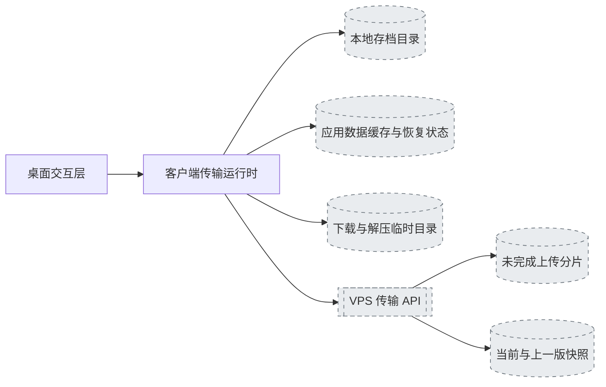
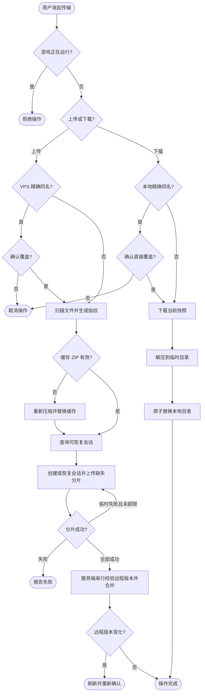

# 存档传输 需求规格说明

> 状态：已确认（活文档，随 change 归档持续演化）
> 创建日期：2026-08-12
> 所属里程碑：Phase 1 - MVP

## 1. 概述

### 1.1 模块简述

存档传输模块负责识别用户选定的独立存档，在游戏关闭时完成客户端与自托管 VPS 之间的上传、下载和覆盖保护，并向用户报告各阶段进度。

### 1.2 所属系统

本模块跨越 Tauri 2 桌面客户端的 Rust 运行时与 Node.js VPS 服务端。桌面表现层负责选择存档、确认覆盖和展示进度；Rust 运行时负责扫描、压缩、分片传输、下载和解压；VPS 服务端负责上传会话、分片校验、快照存储与下载响应。

### 1.3 关联文档

- [项目 README](../../../README.md)
- 项目管理侧 Roadmap：`.eo-project/roadmap.md`

### 1.4 模块架构图

## 2. 用户故事与场景

### 2.1 目标用户

- 在 Windows 与 macOS 设备间切换 Project Zomboid 存档的玩家。
- 使用自有 VPS 部署同步服务、希望自行承担存储与流量成本的玩家或管理员。

### 2.2 用户故事

- 作为玩家，我希望选择一个本地存档上传到 VPS，以便在另一台设备继续游戏。
- 作为玩家，我希望从 VPS 列表精确选择一个存档下载，以便不会误下载同名之外的记录。
- 作为玩家，我希望覆盖本地或远程同名存档前收到明确警告，以便避免无意丢失进度。
- 作为玩家，我希望看到压缩、上传、下载和解压进度，以便判断操作是否仍在执行。

### 2.3 使用场景

1. 用户选择本地 `Sandbox` 或 `Apocalypse` 下的一个存档，VPS 不存在相同模式与名称的记录；客户端压缩并上传为新快照。
2. VPS 已存在相同模式与名称的记录；用户确认后上传覆盖当前快照，服务端将原当前快照保留为上一版。
3. 用户从 VPS 列表选择一个存档下载；本地存在相同模式与名称时，用户确认后由 VPS 版本直接覆盖本地版本。

## 3. 功能需求

### 3.1 输入

- 本地 `Zomboid/Saves` 根目录，来源为自动检测或用户手动选择。
- 本地上传存档，由模式名称、存档名称和绝对目录共同标识。
- 远程下载存档，由模式名称与存档名称精确标识。
- VPS HTTPS API 地址、至少 24 个字符的同步密钥和设备名称。
- 上传或下载覆盖确认，由用户在发现精确同名目标时明确给出。
- 客户端应用数据目录中的存档文件清单、最新 ZIP 缓存和上传恢复状态。

### 3.2 输出

- 上传成功后，VPS 保存目标存档的当前 ZIP 快照、清单信息，并在覆盖时保留上一版 ZIP 快照。
- 下载成功后，本地目标目录包含 VPS 快照解压后的文件；同名旧目录不作为用户备份保留。
- 操作过程中输出阶段名称与该阶段 0% 至 100% 的进度事件。
- 失败时输出可识别的网络、存储、校验、覆盖确认或文件系统错误，且不得把失败操作报告为成功。
- 上传成功或可恢复失败后，每个本地存档最多保留一份经过大小与 SHA-256 校验的最新 ZIP 缓存；上传成功后清除恢复状态。

### 3.3 核心行为描述

1. 上传前检查 Project Zomboid 是否正在运行；检测到游戏进程时拒绝读取和上传存档。
2. 上传时扫描选定存档中的普通文件，忽略 `__MACOSX` 目录且不跟随符号链接。文件清单记录规范化相对路径、大小、修改时间和 SHA-256；路径、大小与修改时间未变化时复用已有文件摘要，否则重新计算。清单按路径排序后生成存档 SHA-256 指纹。
3. 存档指纹匹配时，客户端同时校验缓存 ZIP 是否存在、大小是否一致且 ZIP SHA-256 是否匹配；全部有效时跳过压缩，任一条件失败时重新压缩并原子替换缓存。
4. 客户端按 256 KiB 将 ZIP 拆分上传；每个分片携带 SHA-256 摘要，服务端仅接受长度和摘要均符合会话元数据的分片。
5. 客户端持久保存规范化 VPS endpoint 摘要、同步密钥不可逆摘要、存档身份与指纹、ZIP 摘要与大小、分片参数和上传会话标识；恢复状态不得包含明文同步密钥。
6. 再次上传相同存档时，客户端查询已保存的 VPS 会话；缓存和所有绑定字段匹配且会话有效时，仅上传服务端未确认的分片。会话不存在、过期、不匹配或旧服务端不支持状态查询时，创建新会话并完整上传缓存 ZIP。
7. 单个分片遇到临时网络或服务端错误时，客户端最多额外重试三次，并在重试间采用递增等待；最终失败时保留缓存与恢复状态供下次续传。
8. 全部分片上传完成后，服务端按目标存档串行处理完成请求，重新检查会话创建时记录的远程快照版本，按顺序合并并校验总字节数和 ZIP SHA-256。版本变化时拒绝发布并要求重新确认；版本未变化时将旧当前快照移动为上一版，再写入新当前快照与清单。
9. 下载前检查游戏状态，从用户在 VPS 列表中选中的精确存档读取当前快照，并根据响应总长度报告下载进度。
10. 下载内容先写入临时 ZIP，再解压到目标模式目录下的临时目录；解压完成后才替换正式存档目录。
11. 本地存在相同模式与名称的存档时，前端必须二次确认，后端也必须校验确认标记；取消或缺少确认时不得覆盖。
12. 最终替换失败时，模块恢复原本地目录；替换成功后删除内部临时旧目录，不生成用户可见的 `.backup`。

### 3.4 业务规则与约束

- 存档身份是“模式名称 + 存档名称”的精确组合；任一字段不同都视为独立存档。
- 模式和存档名称不得为空，不得是 `.` 或 `..`，不得包含路径分隔符或冒号。
- 上传覆盖确认只适用于 VPS 上已经存在的精确同名存档。
- 下载覆盖确认只适用于本地已经存在的精确同名存档。
- 客户端在应用数据目录中为每个存档最多保留一份最新 ZIP 缓存；存档变化后原子替换旧缓存。
- 上传恢复状态必须同时绑定 endpoint、同步密钥摘要、模式、存档名、存档指纹和 ZIP SHA-256，任一不匹配都不得复用旧会话。
- 未完成上传默认在最后活动后 7 天过期，保留期可通过服务端环境变量配置；服务启动及节流后的上传 API 请求清理过期元数据、分片和临时文件。
- 上传会话创建后若远程同名快照被其他设备更新，旧会话的覆盖授权失效，最终发布必须返回冲突。

### 3.5 核心流程图 / 状态图

## 4. 非功能需求

### 4.1 性能要求

- 压缩、上传、下载和解压必须在后台任务执行，不得阻塞桌面窗口事件循环。
- 传输使用流式文件读写，客户端不得把完整的大型 ZIP 一次性载入内存。
- 每个阶段必须持续报告自身百分比；不能用固定假进度代替可计算的实际进度。
- 复用缓存时压缩阶段必须明确显示跳过；恢复上传时上传阶段从服务端已确认分片对应的真实字节百分比开始。

### 4.2 安全要求

- 同步密钥仅通过 HTTPS `Authorization` 请求头发送，不写入服务端明文目录名。
- ZIP 解压必须拒绝越界路径，不能向目标目录之外写文件。
- 客户端和服务端必须分别校验覆盖授权，不能只依赖前端弹窗。
- 分片和最终快照必须通过长度或摘要校验防止静默损坏。
- 恢复状态不得保存明文同步密钥；会话状态查询只能访问当前同步密钥对应的数据空间。
- 同一远程存档的最终发布在单个服务进程内必须串行，版本基线变化时不得沿用旧覆盖确认。

### 4.3 兼容性要求

- 客户端源码支持 Windows 与 macOS 的用户主目录、路径分隔符和游戏进程名称。
- Windows 与 macOS 生成的 ZIP 内部路径统一使用 `/`，确保跨平台互传。
- macOS 生成的 `__MACOSX` 元数据目录不得作为游戏存档上传。

## 5. 边界与限制

### 5.1 明确包含（In Scope）

- 单个独立存档的手动上传和下载。
- 精确同名覆盖确认。
- ZIP 压缩、分片校验、阶段进度与临时网络错误重试。
- VPS 当前与上一版快照存储。
- 每个存档一份持久 ZIP 缓存、增量文件指纹与缓存完整性校验。
- 失败或重启后的跨任务分片续传和真实恢复进度。
- VPS 会话状态查询、同目标串行发布、远程版本冲突保护和过期会话清理。

### 5.2 明确排除（Out of Scope）

- 后台自动同步、文件级增量同步与双向进度合并。
- 公共托管云、账号系统、共享权限和跨用户协作。
- 游戏运行期间的热备份或上传。
- 服务端快照内容的额外端到端加密。

### 5.3 已知约束

- 存档体积会随地图探索持续增长，压缩和传输耗时取决于文件数量、磁盘与网络速度。
- VPS 需要同时容纳当前、上一版和未完成上传分片，瞬时磁盘占用高于单份快照。
- 客户端应用数据目录会为每个上传过的存档保留一份最新 ZIP，磁盘占用接近这些存档的压缩后总大小。
- 未完成上传默认最多保留 7 天，活动上传会刷新过期时间。
- macOS 逻辑尚待真实设备编译和运行验证。

## 6. 验收标准（Acceptance Criteria）

- **AC-1**
  - **Given** 游戏未运行且本地存档有效
  - **When** 用户上传 VPS 不存在的精确存档
  - **Then** 服务端保存可下载的当前快照，客户端显示压缩、分片上传和服务端保存进度
- **AC-2**
  - **Given** VPS 已存在相同模式与名称的存档
  - **When** 用户拒绝上传覆盖确认
  - **Then** 客户端不创建上传会话，VPS 当前与上一版快照均不改变
- **AC-3**
  - **Given** 单个上传分片遇到临时错误
  - **When** 后续重试在限制内成功
  - **Then** 上传从该分片继续并最终完成，不重复已经完成的本次任务内前序分片
- **AC-4**
  - **Given** 用户选择一个 VPS 存档且本地存在精确同名存档
  - **When** 用户拒绝下载覆盖确认
  - **Then** 不发起快照下载，本地存档保持不变
- **AC-5**
  - **Given** 用户确认下载覆盖且快照完整
  - **When** 下载和解压完成
  - **Then** VPS 版本替换本地同名目录，不保留 `.backup`，窗口在全过程保持响应并显示进度
- **AC-6**
  - **Given** 下载 ZIP 无效或解压失败
  - **When** 模块无法完成临时目录解压
  - **Then** 本地正式存档目录保持原状，临时下载与解压数据被清理
- **AC-7**
  - **Given** Project Zomboid 正在运行
  - **When** 用户尝试上传或下载
  - **Then** 操作在读取或覆盖存档前被拒绝
- **AC-8**
  - **Given** 某存档已有指纹匹配且 ZIP 大小与 SHA-256 均有效的缓存
  - **When** 用户再次上传且存档未变化
  - **Then** 客户端跳过压缩并直接进入上传或续传阶段
- **AC-9**
  - **Given** VPS 会话已有部分有效分片且客户端缓存和恢复状态匹配
  - **When** 客户端在失败或重启后再次上传同一未变化存档
  - **Then** 客户端只上传缺失分片，进度从已确认真实字节百分比开始
- **AC-10**
  - **Given** 未完成上传最后活动时间超过配置保留期
  - **When** 服务启动或触发节流后的上传 API 请求
  - **Then** VPS 删除会话元数据、分片和临时文件
- **AC-11**
  - **Given** 上传会话创建后另一设备更新了远程同名存档
  - **When** 旧会话请求最终发布
  - **Then** VPS 返回冲突且不改变较新快照，客户端要求刷新并重新确认
- **AC-12**
  - **Given** 客户端连接不支持会话状态查询的旧 VPS 服务端
  - **When** 用户上传具有有效本地 ZIP 缓存的存档
  - **Then** 客户端仍跳过压缩，但创建新会话并完整上传

## 7. 开放问题（Open Questions）

无。

---

> **变更历史**：本模块的关联变更与变更记录见 [spec-history.md](spec-history.md)。
